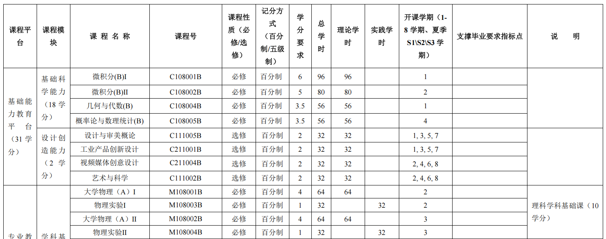

## 关于培养方案

在北交，你的本科学习会完全按照培养方案进行，因此，请详细阅读你的培养方案，不清楚的地方一定要找辅导员问，这关乎你是否能正常毕业。这份文档你的辅导员会发给你，如果还没收到，记得问他们要。

培养方案会说明你需要上哪些课，在哪个学期。学期按照连续计数，一年两个学期，四年为第一到第八个学期。一般来说你可以完全跟着培养方案走，就可以正常毕业。如果你有一些其他想法，想要跨学期选课，请注意，选课只分单数和双数学期的区别，例如某学年第一学期和第二学期，可以选的课不同，但同为单数或双数学期的课可以互相选，例如大一第一学期可以选大二，大三，大四第一学期的课，在培养方案中会列为第1，3，5，7学期。

一般来说跨学期选课有三种考虑，第一，提前上完政治课和其余水课，把后面的时间精力全部用于学习专业课，这样后面学专业课就没有水课拖累。第二，提前选专业课，把水课按培养方案上或者留到大四研究生有了着落后上，权当放松。这样的好处是低年级如果上完了专业课，就可以去实习或者进实验室做研究，但坏处是没有基础直接上容易翻车。第三，重修专业课以提高GPA。如果有其他骚操作欢迎补充。

培养方案示例

