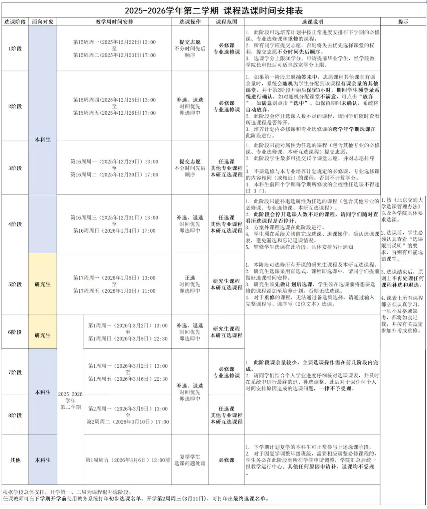

## 关于选课

经管学院教学科侯老师常说一句话，GPA高不高不光和你学习努不努力有关，还和你有没有选好课有关。

我非常认同。

关于选课，你需要知道的第一件事是，**课程类别**。

对于大一刚入学的同学来说，课程都是置入的，要从第二学习才开始选课。

- **置入课**，指的是不需要你选择，学校课程系统自动将课程置入你的课表。一般来说直到大三都有可能有置入课。需要提醒的是，学校系统有可能犯错，你需要自己检查课程是否置入成功（这很离谱，咱可是有A-的计算机学院的）刚入学的同学可能对培养方案怎么看还不太熟悉，不太懂怎么检查置入课是否正确，比较简单的方法就是找几个同学对一下，没有出入就没问题。如果你实在不放心，就去教学科找老师帮你看（当然这样可能有点太费时间了 :) ）

- **专业必修课**，是你一定要上的课，选课时只能选老师，可以找学长学姐打听一下老师的特点。需要说明的是，建议各位不要只找被评价为给分好的老师，如果老师讲的好，给分也好自然是上乘，但如果只能选一样，建议选讲课好的老师，然后分数自己争取。（如果讲的烂给分也烂，建议开除）

- **专业选修课**，一般需要在多个专业课当中选择部分，所以既可以选课程，也可以选老师。建议第一根据兴趣，如果都不感兴趣，就打听一下哪些课程比较有用。
- **全校任选课**，这些课程没有要求，全部根据兴趣选择，建议如果有感兴趣的可以上一两门，陶冶情操。此外，如果有同学有看整体成绩而非专业成绩的需求，可以选几门课拉高GPA。
- **其他专业专业课**，(不要质疑我打重了...) 我们学校这点比较好，哪怕你不是某专业学生，如果只是想上课的话，可以去选其他专业的课程。

你需要知道的第二件事是，**选课流程**。

这点倒是不用担心，每次选课之前都有选课指导会。一般会分阶段选课，持续2-3周。**具体看你们的指导会说明**，示例如下

需要说明的是，自（我也忘了什么时候）开始，可以退课了，在开学第一周如果对某些课程不满意，可以在对应时间退课（这可实在太好了）。

还有一点需要提醒，在学期末尾要进行**评教**，如果不完成评教无法进行选课。