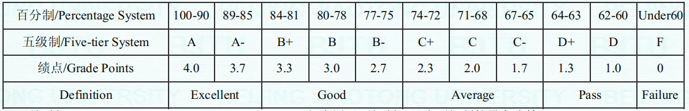

## 成绩与GPA

什么是GPA？

GPA 的全称是 Grade Point Average（平均绩点）。在我校一般在0-4之间。

每门课你会得到一个百分制的分数或者从F到A的评级，最终在成绩单上获得一个加权百分制成绩与GPA。

百分制成绩/字母评级 与 绩点 映射关系示例 （注：每一级计算方式可能不同）

对于百分制成绩
$$
加权成绩=\sum \frac{单科成绩}{单科成绩×单科学分}
$$
对于GPA
$$
GPA=\sum \frac{单科绩点}{单科绩点×单科学分}
$$
